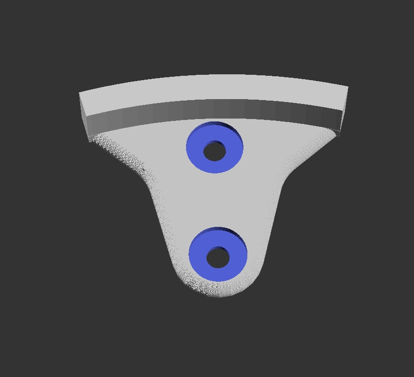

# Disc Golf Wall Disc Hanger 

This is a simple model that can be 3D printed to hang disc golf disks from the wall.

Can be used with screws or adhesive 3M Command Strips.

## Printing 

If you have a 3D printer, you can print your own by downloading the [STL file](https://github.com/jduckles/discholder/blob/master/DiscHolder.stl). 

## Source 

This was built using the free and open source CAD tool [OpenSCAD](https://openscad.org/). Annotated source available in [`DiscHolder.scad`](DiscHolder.scad)

## Modifying 

Clone with `--recursive` to pul down "Round-Anything" library used to build rounded geometries.

```
git clone --recursive https://github.com/jduckles/discholder
```

# Finished model and [STL](DiscHolder.stl)



